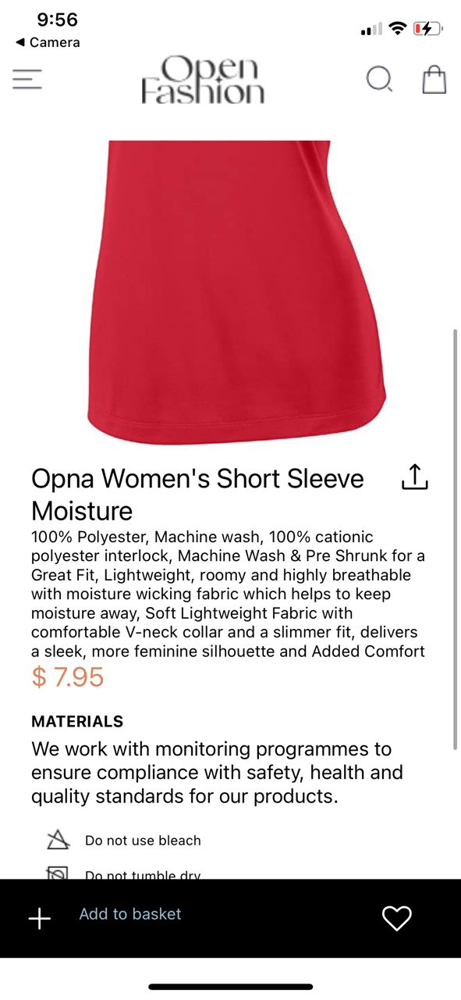
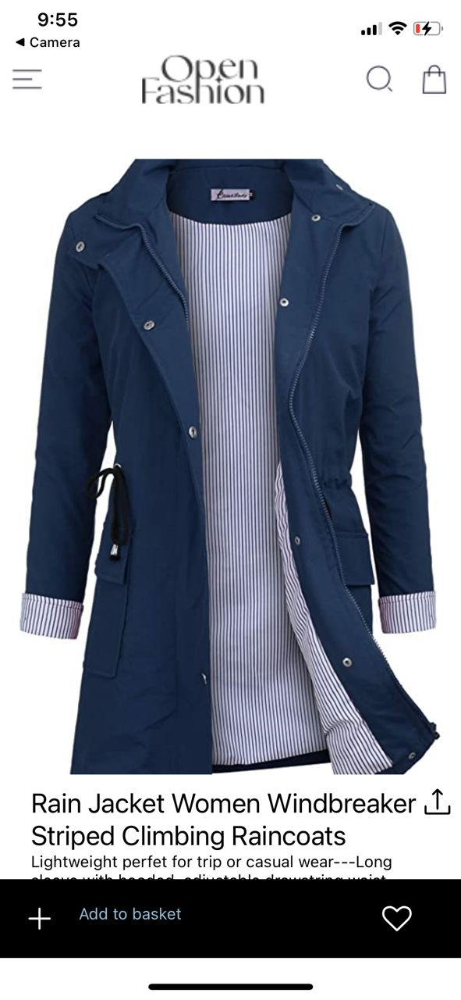
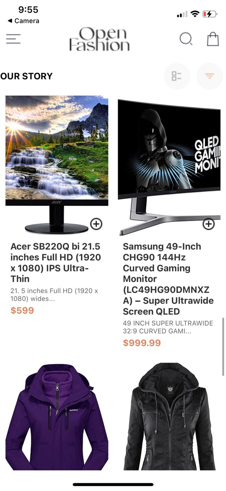
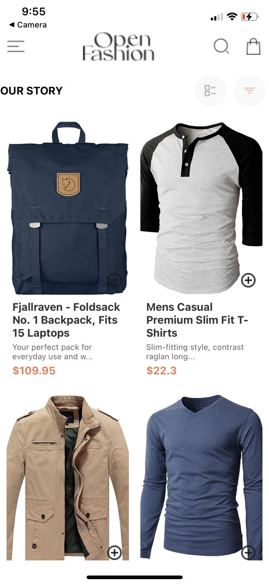

# React Native E-Commerce App

### Overview
This is a React Native e-commerce application that showcases product details and allows users to add items to their cart. The app features a clean and user-friendly design, leveraging React Navigation for navigation between screens and AsyncStorage for persistent data storage.

## Design Choices

### User Interface
Clean and Simple Design: The app uses a minimalist design approach to ensure that the user experience is intuitive and clutter-free.
Consistent Theming: The application maintains a consistent theme across all screens, using similar fonts, colors, and spacing.
Product Detail Focus: The product detail page provides comprehensive information about each product, including images, descriptions, pricing, and care instructions.

### Navigation
React Navigation: The app utilizes React Navigation for seamless navigation between different screens. The stack navigator is used to manage the screen transitions.
Menu Integration: A side menu is integrated into the app, allowing users to access different sections easily.

### Data Storage
AsyncStorage: AsyncStorage is used to manage the shopping cart. It allows for persistent storage of cart items, ensuring that the cart contents are preserved even when the app is closed and reopened.
# Implementation Details

### Fetching Product Data
The app fetches product details from the FakeStore API. This is done asynchronously when the ProductDetail component mounts. The fetched data is stored in the component's state and displayed to the user.

## Adding Items to Cart
The handleAddToCart function manages the addition of products to the cart. It retrieves the existing cart from AsyncStorage, updates the cart with the new product, and then saves the updated cart back to AsyncStorage.

# Screenshots

