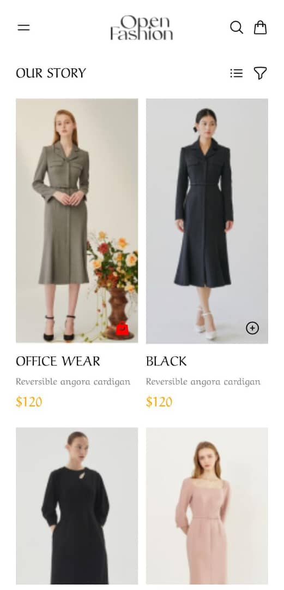
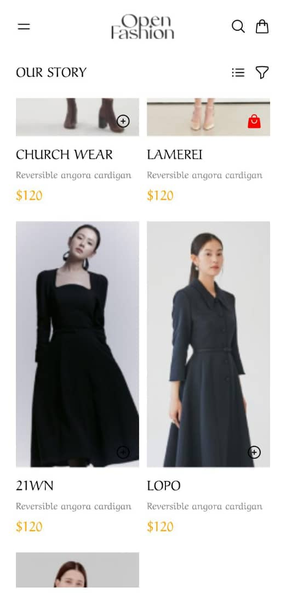
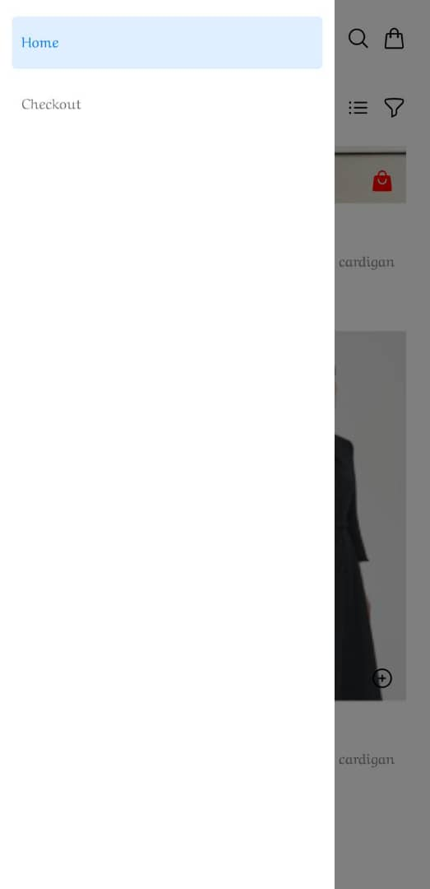
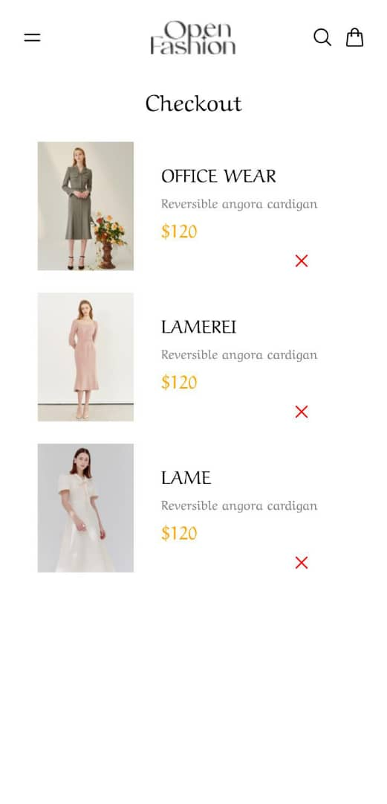

# DCIT 202 Assignment 6
## Kwabena Owusu-Darko (11170189)

This assigment involved converting a figma design of an e-commerce app into a functioning Expo application.

I used custom components to display the product details. I implemented app navigation with the Drawer navigator, and even included a custom header component with the drawer toggle functionality.

I used Async storage to keep track of orders and used helper functions to simplify the add, remove and list functionalities. I also utilized a custom font via the expo google fonts package.

This app consisted of two pages:

### The Home Page
This custom component, implemented with Views, Icons, and a few images, simulated a standard ui for an e-commerce application.

### The Checkout Page
This component presented the various items selected for checkout by the user, completely reactive with the ability to remove an item. 

Here are a few screenshots of the application:

